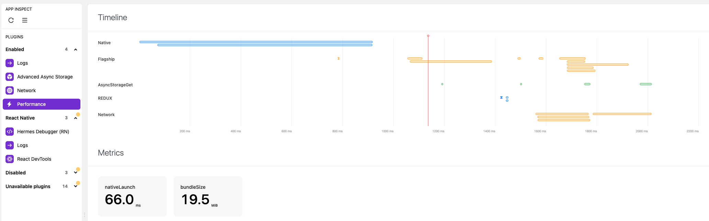
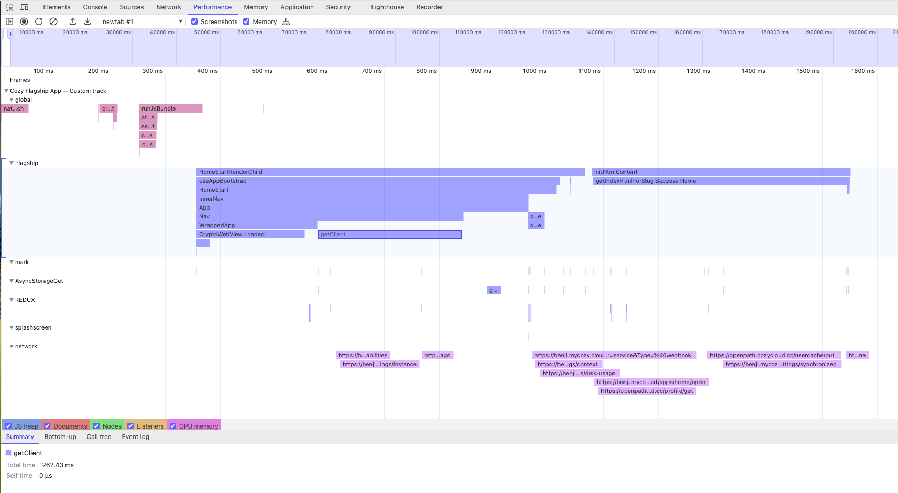

# How to debug performances

Since [#1264](https://github.com/cozy/cozy-flagship-app/pull/1264) it is possible to measure the Flagship App's performances.

This document's goal is to describe how to retrieve measurements, how to read them and how to add new measurements.

The performance measurements are based on `react-native-performances` plugin and are complementary to CozyClient performance API implementation. More about those two concept can be read here:
- `react-native-performances`: https://github.com/oblador/react-native-performance
- CozyClient Performance API: https://github.com/cozy/cozy-client/blob/master/docs/performances.md

# Nomenclature

- `PerformanceAPI`: The API provided by CozyClient for measuring timings in the code base
- `Performance devtools`: Browsers devtools pane dedicated to performance (i.e. [Chrome devtools](https://developer.chrome.com/docs/devtools/performance) and [Firefox profiled](https://profiler.firefox.com/docs/#/))
- `Flipper performances plugin`: Plugin for Flipper dedicated to performance readings
- `Mark`: A temporal event
- `Measure`: A timing measurement between two temporal events

# Retrieve measurements

There are two way to retrieve measurements:

- In realtime using Flipper
- Asynchronously using Universal Links

## Flipper plugin

Flipper allows to read performance measurements in realtime through the `flipper-plugin-performance` plugin:

- Open Flipper
- Install the plugin `flipper-plugin-performance`
- Start the Flagship app in development mode
- On Flipper, open the `Performance` pane



## Universal Links

When it is not possible to use the Flipper plugin, then the Flagship App allows to share performances measurements by email.

To do this:

- Open the Flagship app and do the scenario that needs to be measured
- Open one of the following links:
  - https://links.mycozy.cloud/flagship/sendperfs
  - cozy://sendperfs

When clicked, the Flagship App will upload the performance measurements for the current session in the user's Cozy and then an email intent will allow to send a link to download them.

The measurements are uploaded into the `Settings/AALogs/<current_date>` folder.

# Read the measurements

When downloading the measurements that were generated through Universal Link, then it is possible to read them using Chromium devtools.

To do this:

- Download the measurements file
- From the `cozy-flagship-app` project, run the following command:
  - `yarn perf:convert <path_to_downloaded_file>`
  - This will generate a new file in the same folder as the targeted file, and suffixed with `_converted`
- In a Chromium browser, open the devtools
- Open the `Performance` pane
- In the upper-left of the pane, click on `Load profile...` and selected the `_converted` file



# Add new measurements

In order to add new measurements, it is possible to use the API from `/app/domain/performances/measure`.

This API provides `mark()` and `measure()` methods that are the core concept of doing measurements.

Those methods have the same behavior as the ones available in CozyClient. Their API and behaviour are described in [the related documentation](https://github.com/cozy/cozy-client/blob/master/docs/performances.md#mark-method)

## Add new measurements in a method

In order to measure the duration of a methods or part of a methods:

```js
import rnperformance from '/app/domain/performances/measure'

const someMethod = () => {
  const markName = rnperformance.mark('someMethod')

  // ... Method code

  rnperformance.measure({ markName })
}
```


## Add new measurements in a React component

In order to measure the duration of a React component initialization:

```js
import rnperformance from '/app/domain/performances/measure'

const SomeReactComponent = () => {
  const [markName] = useState(() => rnperformance.mark('SomeReactComponent'))

  useEffect(() => {
    rnperformance.measure({
      markName: markName,
      measureName: 'Mount <App />'
    })
  }, [markName])
}
```

## Add new measurements in CozyClient

See [related documentation](https://github.com/cozy/cozy-client/blob/master/docs/performances.md)