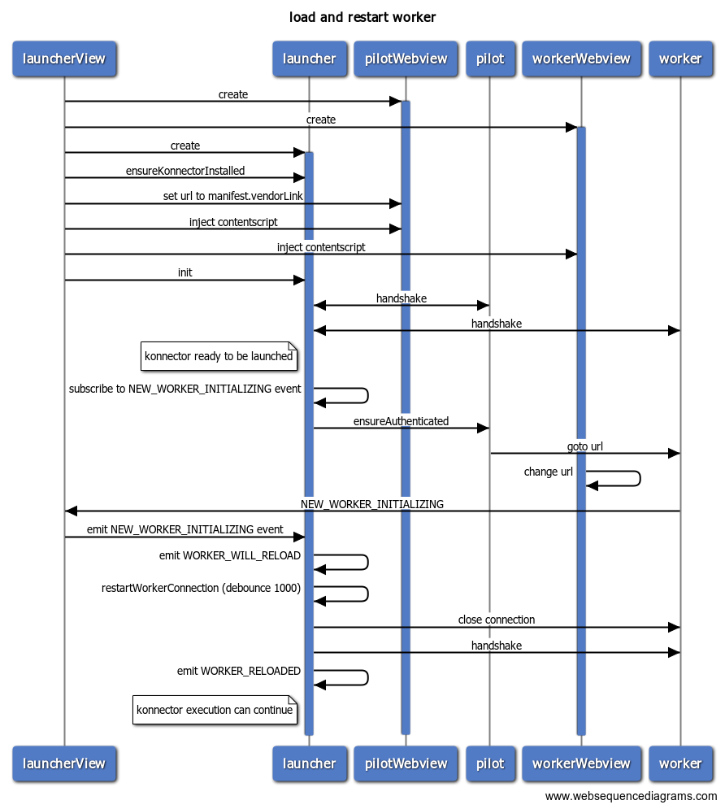

# Load and restart of worker



Diagram generated on [websequencediagrams.com](https://www.websequencediagrams.com/)

```
title load and restart worker

participant launcherView
participant launcher
participant pilotWebview
participant pilot
participant workerWebview
participant worker

launcherView->+pilotWebview: create
launcherView->+workerWebview: create
launcherView->+launcher: create
launcherView->launcher: ensureKonnectorInstalled
launcherView->pilotWebview: set url to manifest.vendorLink
launcherView->pilotWebview: inject contentscript
launcherView->workerWebview: inject contentscript
launcherView->launcher: init
launcher<->pilot: handshake
launcher<->worker: handshake
note left of launcher: konnector ready to be launched
launcher->launcher: subscribe to NEW_WORKER_INITIALIZING event
launcher->pilot: ensureAuthenticated
pilot->worker: goto url
workerWebview->workerWebview: change url
worker->launcherView: NEW_WORKER_INITIALIZING
launcherView->launcher: emit NEW_WORKER_INITIALIZING event
launcher->launcher: emit WORKER_WILL_RELOAD
launcher->launcher: restartWorkerConnection (debounce 1000)
launcher->worker: close connection
launcher->worker: handshake
launcher->launcher: emit WORKER_RELOADED
note left of launcher: konnector execution can continue
```
