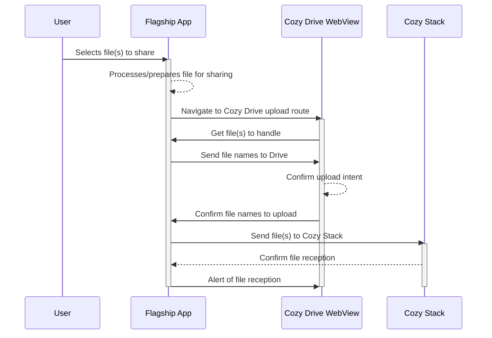
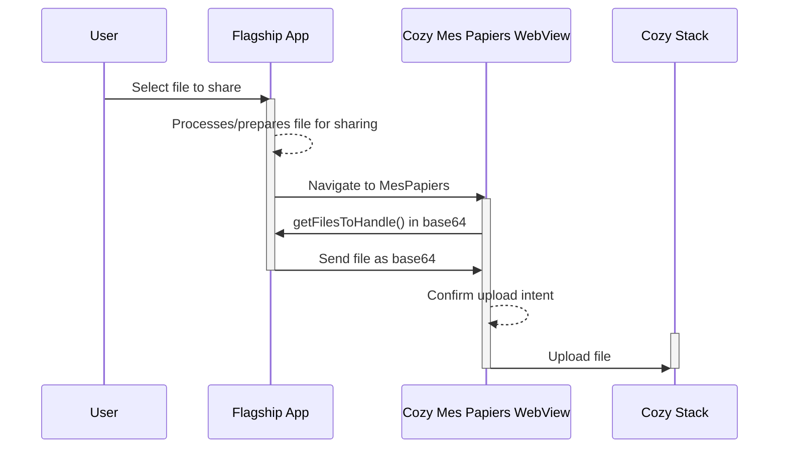
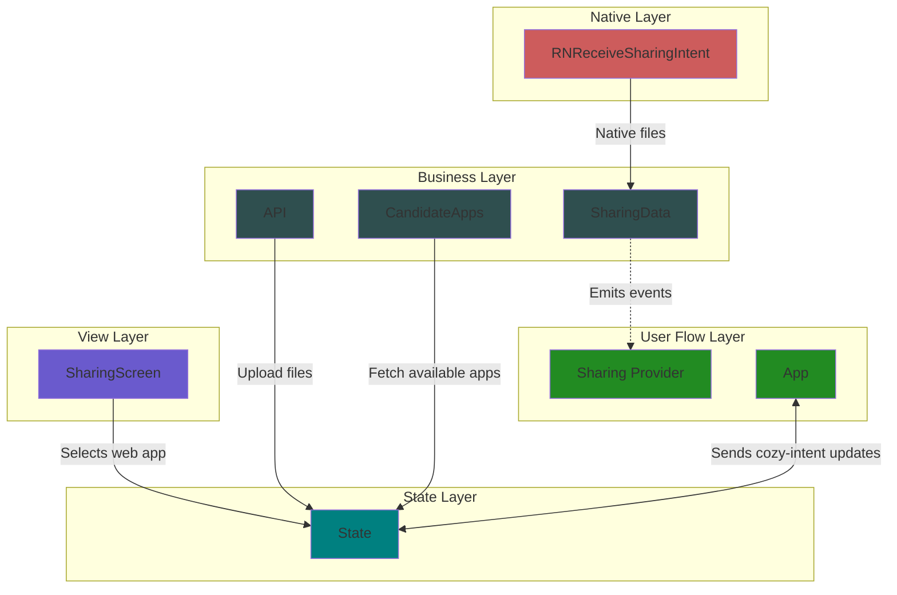

### Sequence Diagram (Drive):

```mermaid
sequenceDiagram
    participant User
    participant FlagshipApp as Flagship App
    participant CozyDriveWebView as Cozy Drive WebView
    participant CozyStack as Cozy Stack

    User->>FlagshipApp: Selects file(s) to share
    activate FlagshipApp
    FlagshipApp-->>FlagshipApp: Processes/prepares file for sharing
    FlagshipApp->>CozyDriveWebView: Navigate to Cozy Drive upload route
    activate CozyDriveWebView
    CozyDriveWebView->>FlagshipApp: Get file(s) to handle
    FlagshipApp->>CozyDriveWebView: Send file names to Drive
    CozyDriveWebView-->>CozyDriveWebView: Confirm upload intent
    CozyDriveWebView->>FlagshipApp: Confirm file names to upload
    FlagshipApp->>CozyStack: Send file(s) to Cozy Stack
    activate CozyStack
    CozyStack-->>FlagshipApp: Confirm file reception
    FlagshipApp->>CozyDriveWebView: Alert of file reception
    deactivate FlagshipApp
    deactivate CozyDriveWebView
    deactivate CozyStack
```

### Sequence Diagram (Mes Papiers):

```mermaid
sequenceDiagram
    participant User
    participant FlagshipApp as Flagship App
    participant CozyMesPapiersWebView as Cozy Mes Papiers WebView
    participant CozyStack as Cozy Stack

    User->>FlagshipApp: Select file to share
    activate FlagshipApp
    FlagshipApp-->>FlagshipApp: Processes/prepares file for sharing
    FlagshipApp->>CozyMesPapiersWebView: Navigate to MesPapiers
    activate CozyMesPapiersWebView
    CozyMesPapiersWebView->>FlagshipApp: getFilesToHandle() in base64
    FlagshipApp->>CozyMesPapiersWebView: Send file as base64
    deactivate FlagshipApp
    CozyMesPapiersWebView-->>CozyMesPapiersWebView: Confirm upload intent
    activate CozyStack
    CozyMesPapiersWebView->>CozyStack: Upload file
    deactivate CozyMesPapiersWebView
    deactivate CozyStack
```

### Data flow Diagram:

```mermaid
graph TD
    subgraph User Flow Layer
        SProvider[Sharing Provider]
        APP[App]
    end

    subgraph State Layer
        ST[State]
    end

    subgraph View Layer
        SS[SharingScreen]
    end

    subgraph Business Layer
        API[API]
        CA[CandidateApps]
        SService[SharingData]
    end

    subgraph Native Layer
        RNRSI[RNReceiveSharingIntent]
    end

    RNRSI -->|Native files| SService
    SS -->|Selects web app| ST
    API -->|Upload files| ST
    CA -->|Fetch available apps| ST
    APP <-->|Sends cozy-intent updates| ST
    SService -.->|Emits events| SProvider

    style SS fill:slateblue
    style API fill:darkslategray
    style CA fill:darkslategray
    style SService fill:darkslategray
    style SProvider fill:forestgreen
    style APP fill:forestgreen
    style RNRSI fill:indianred
    style ST fill:teal
```