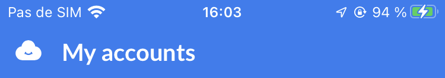

# `FlagshipUI` API Documentation


## Nomenclature

- `Status bar`: The phone's top bar where notification, clock and network info are displayed
- `Navigation bar`: The phone's bottom bar where navigation buttons are displayed
- `FlagshipUI`: Object that describes `Status bar` and `Navigation bar` colors and theme
- `SettedUI`: Object that contains a component `id`, its `zIndex` and its `FlagshipUI`
- `FlagshipState`: Object that contains `SettedUI`s for all the currently mounted components
- `ScreenIndexes`: Enum that describes all screens' `zIndex`

## Introduction

`FlagshipUI` API is a set of hooks, services and methods that are used to change the colors and theme for `Status bar` and `Navigation bar` so they fit the App's UI


## The FlagshipUI interface

The `FlagshipUI` interface can be used to describe `Status bar` and `Navigation bar` colors and themes

Each bar can be described with a `background` color, an `overlay` color and a `theme`:
- `background`: The main color of the bar
  - keys: `topBackground`, `bottomBackground`
  - values: can be any hexadecimal color or `transparent` or unset
- `overlay`: An optional overlay that affect the bar's color. This value can be used when the UI displays a modal with a backdrop
  - keys: `topOverlay`, `bottomOverlay`
  - values: can be any rgba color or `transparent` or unset
- `theme`: The bar's text theme
  - keys: `topTheme`, `bottomTheme`
  - values: `dark` if the text should be displayed in black, `light` if the text should be displayed in white

### Examples of FlagshipUI for the status bar
Example of status bar for Cozy Banks:


```ts
const flagshipUI = {
  topBackground: '#97ef2',
  topOverlay: 'transparent',
  topTheme: 'light'
}
```

Example of status bar for Cozy Home:


```ts
const flagshipUI = {
  topBackground: 'transparent',
  topOverlay: 'transparent',
  topTheme: 'light'
}
```

Example of status bar for Cozy Home's logout modal:


```ts
const flagshipUI = {
  topBackground: 'transparent',
  topOverlay: 'rgba(0, 0, 0, 0.5)',
  topTheme: 'light'
}
```

Example of status bar for Cozy Home's Konnector modal:


```ts
const flagshipUI = {
  topBackground: '#fff',
  topOverlay: 'transparent',
  topTheme: 'dark'
}
```

## The FlagshipUI service

The FlagshipUI service is a set of states and methods that allows the developper to declare UI components and their impact on `Status bar` and `Navigation bar` colors and themes

A component's declaration consist of a component `id`, its corresponding `FlagshipUI` and a `zIndex`. This group of value is named a `SettedUI` in the code

A component can be registered using the `registerComponent` method

A component can be unregistered using the `unregisterComponent` method

A component can update its declared colors and theme using the `setColor` method

The FlagshipUI service then keeps track of all those components declarations in the `flagshipState` array and compute the correct colors and themes for each bar based on components' `zIndex` priority. The component with the higher `zIndex` is the one that will impact the resulting colors and themes

To make this work, each component should declare itself when mount in the React tree, and should be removed when unmount

The result is the `flagshipState` that contains an array of declared components with their `FlaghshipUI` and `zIndex`. During the application lifecycle, this array will be updated by inserting and removing components based on their respective lifecycles. Every time the array change, then the resulting bars colors and theme is computed

This service is not meant to be used directly (although it can be), instead use the `useFlagshipUI` hook

## The useFlagshipUI hook

The `useFlagshipUI` hook can be used in any React component in order to register/unregister it to the `FlagshipUI` service

This hook automatically handle the component's lifecycle and will internally call `registerComponent` when the component is mount and `unregisterComponent` when it is unmount

Also this hook allows to declare the component with a default `FlagshipUI`, and also to update its `FlagshipUI` when needed

### Example of component declared with a default FlagshipUI
```tsx
// Declare initial values for FlagshipUI outside of the component
// in order to be stable and not trigger the hook on every rerender
const defaultFlagshipUI: FlagshipUI = {
  topTheme: 'light',
  bottomTheme: 'light'
}

const YourComponent = (): JSX.Element => {
  useFlagshipUI(
    'YourComponentName',
    ScreenIndexes.YOUR_COMPONENT_ZINDEX,
    defaultFlagshipUI
  )

  return <>YOUR COMPONENT UI</>
}
```

### Example of component that updates its FlagshipUI in a `useEffect`
```tsx
const YourComponent = (): JSX.Element => {
  const { setFlagshipColors } = useFlagshipUI(
    'YourComponentName',
    ScreenIndexes.YOUR_COMPONENT_ZINDEX,
    defaultFlagshipUI
  )

  useEffect(() => {
    if (some_condition) {
      setFlagshipColors({
        topTheme: 'dark',
        bottomTheme: 'dark'
      })
    }
  }, [some_dependencies])

  return <>YOUR COMPONENT UI</>
}
```

## The ScreenIndexes enum

The goal of the `FlagshipUI` API is to handle multiple components declaration in parallel and to change `Status bar` and `Navigation bar` colors and themes based on the topmost visible component

Sadly, there is no automatic way to keep track of the topmost visible component

For example if the App has a default cozy-app configured. Then on startup:
- The CozyAppScreen is rendered
  - This screen lives in a dedicated Route as a `transparentModal` (see `AppRouter.jsx`)
- The HomeView is rendered after the CozyAppScreen
- The LockScreen may be rendered on top of those two views

Then we should need a way to know that the CozyAppScreen's `FlagshipUI` should take priority over the HomeView's one, but not on the LockScreen one (the LockScreen has priority over all other screens except the SplashScreen)

After the startup, if the user triggers a sharing, this will close the CozyAppScreen and display the OSReceiveScreen on top of the HomeView, but still under the LockScreen

Here again we should keep track of which screen is on top of the others and we cannot use components declaration order to compute the result. Also the react-native framework doesn't give access to it's rendered tree so we cannot use it to know which component is rendered on top of others

The easiest way to handle this is to maintain the `ScreenIndexes` enumeration which declare possible screens and their respective `zIndex`

This will allow to keep track of which screen should appear on top of the others, whatever their mount order and without having to keep track of the App's context

Note that this approach seems heavy to maintain, but as we only have a few screens and layers in the app this is still acceptable

This `ScreenIndexes` enum should then be used when calling `useFlagshipUI` hook to give any component a `zIndex`